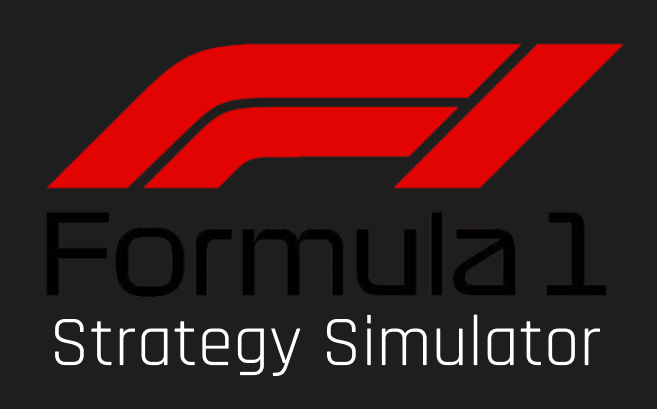

# F1 Strategy Simulator

> Note: At this time, the simulator is in its 1st version. After project approval, I plan on adding more maps, weather options and enhancing the gameplay!!!

<p align="center">
  
</p>

A browser based Formula 1 strategy simulator where you take the role of a race engineer, making important decisions on tires, fuel, DRS, and pit stops across iconic circuits!

I created and built this project for [Beest](https://beest.hackclub.com/home)

---

## Overview

So, basically the idea behind this Strategy Simulator is to give players a hands on experience of what happens in an F1 Grand Prix behind the actual race and the cars. I absolutely love the efforts that F1 team engineers put to make their vehicle the best one on the grid. The fuel quantity, tire softness and many such stuff wins races.

In this simulator, you play as an F1 engineer and your overall job is to control the car. Meaning, you will have to choose the tire softness, fuel mode, overtake scenarios and take these small risks to win the Grand Prix. As of now, the simulator has several weather options as well which also make it difficult to control.

---

## Images

<p align="center">
  
  <br>
  <em>Home Screen</em>
</p>

<p align="center">
  
  <br>
  <em>Driver Selection</em>
</p>

<p align="center">
  
  <br>
  <em>Circuit selection</em>
</p>

<p align="center">
  
  <br>
  <em>Strategy Simulator</em>
</p>

---

## Features

- Multiple circuits
- Select your favorite team and driver
- DRS System
- Fuel management system
- Pit stop strategy
- Race control messages
- Radio conversations

---

## How to Run

Clone the repository

```bash
git clone https://github.com/YOUR_USERNAME/f1-simulator.git
```

Install dependencies

```bash
npm install
```

Run the development server

```bash
npm run dev
```

Build for production

```bash
npm run build
```

---

## Tech Stack

- React
- TypeScript
- Vite
- HTML5 Canvas
- CSS

---

## Acknowledgements

I would like to thank the entire team at [Beest](https://beest.hackclub.com/home) for conducting such a wonderful experience!
I would also like to thank Formula 1!
