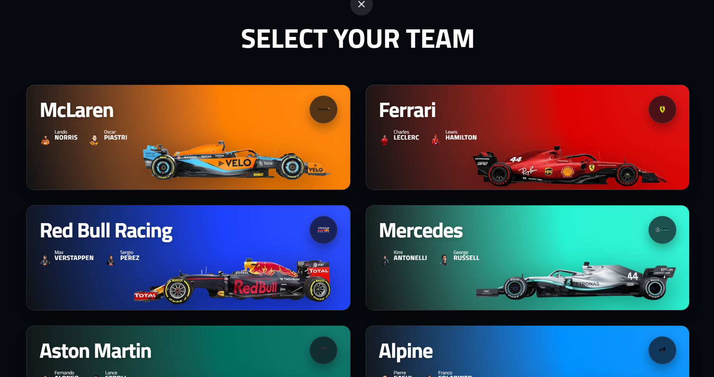
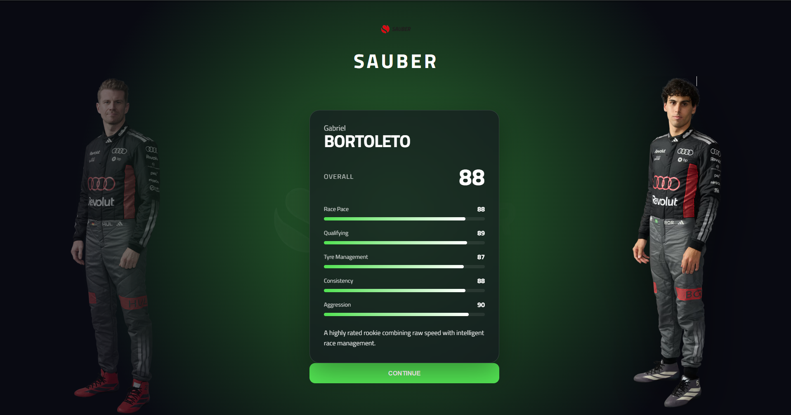
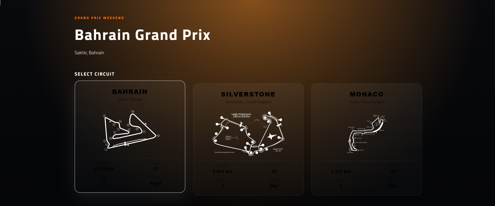
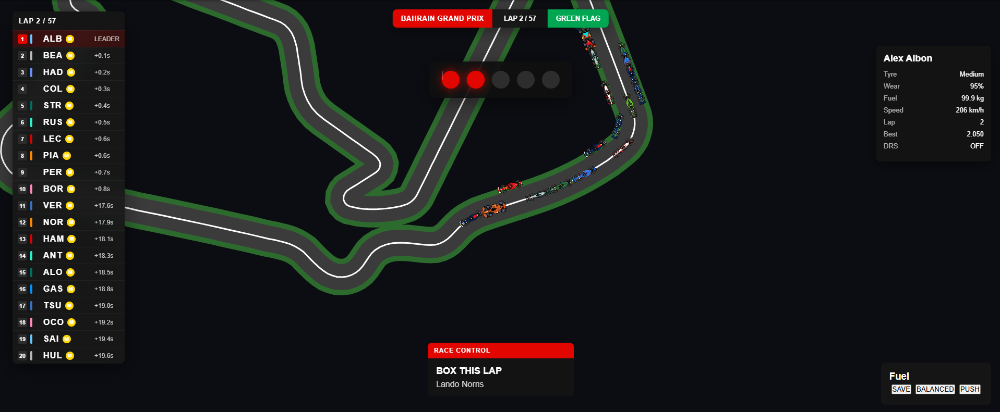

# F1 Strategy Simulator

A browser based Formula 1 strategy simulator where you take the role of a race engineer, making important decisions on tires, fuel, DRS, and pit stops across iconic circuits!

I created and built this project for [Horizons | Hack Club](https://horizons.hackclub.com/app)

---

## Overview

This simulator puts you in the role of an actual F1 race engineer. Instead of driving the car, your objective is to make strategic decisions throughout the race, including tire management, fuel usage, pit stop timing and overtaking others.

I created this simulator because of my fascination and obsession of F1 race engineers and the cool jobs they do every grand prix!

---

## Images

<p align="center">
  
  <br>
  <em>Home Screen</em>
</p>

<p align="center">
  
  <br>
  <em>Driver Selection</em>
</p>

<p align="center">
  
  <br>
  <em>Circuit selection</em>
</p>

<p align="center">
  
  <br>
  <em>Strategy Simulator</em>
</p>

## Features

- Multiple circuits
- Select your favorite team and driver
- DRS System
- Fuel management system
- Pit stop strategy
- Race control messages
- Radio conversations

---

## How to Run

Clone the repository

```bash
git clone https://github.com/YOUR_USERNAME/f1-simulator.git
```

Install dependencies

```bash
npm install
```

Run the development server

```bash
npm run dev
```

Build for production

```bash
npm run build
```

---

## Tech Stack

- React
- TypeScript
- Vite
- HTML5 Canvas
- CSS

---

## Acknowledgements

I would like to thank the entire team at [Horizons | Hack Club](https://horizons.hackclub.com/app) for conducting such a wonderful hackathon!
I would also like to thank Formula 1!
